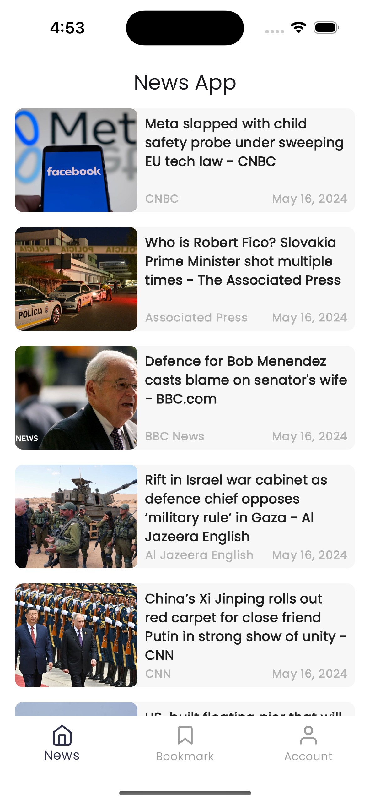
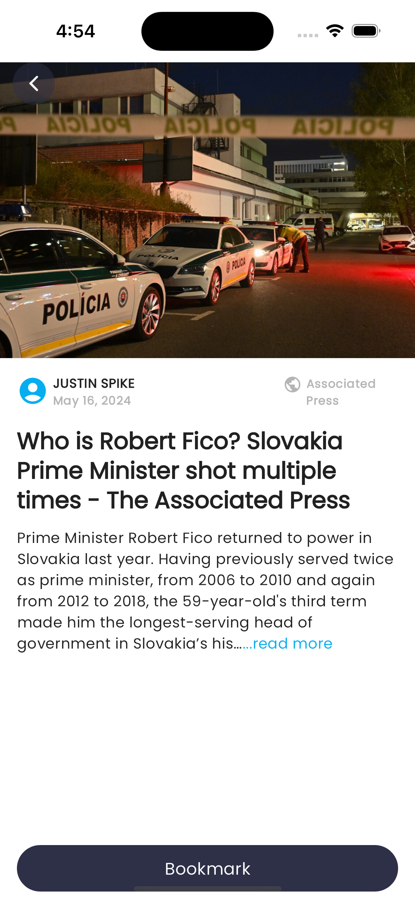
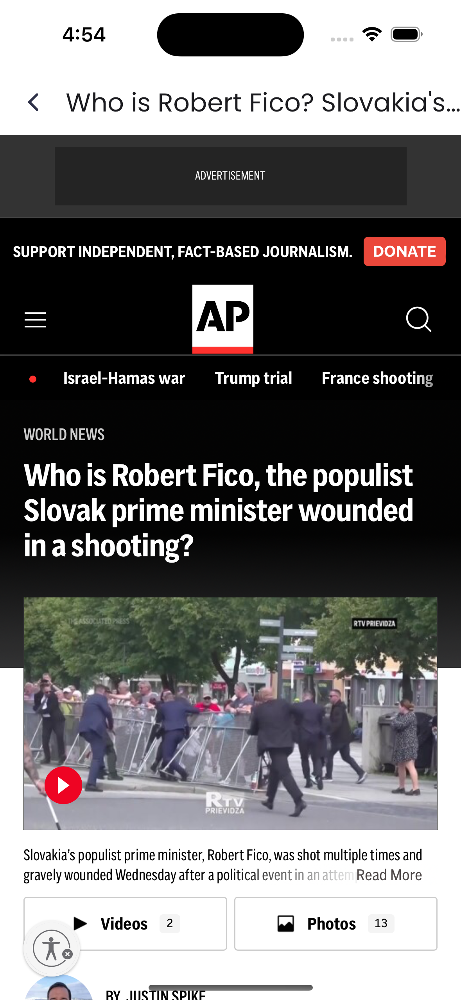
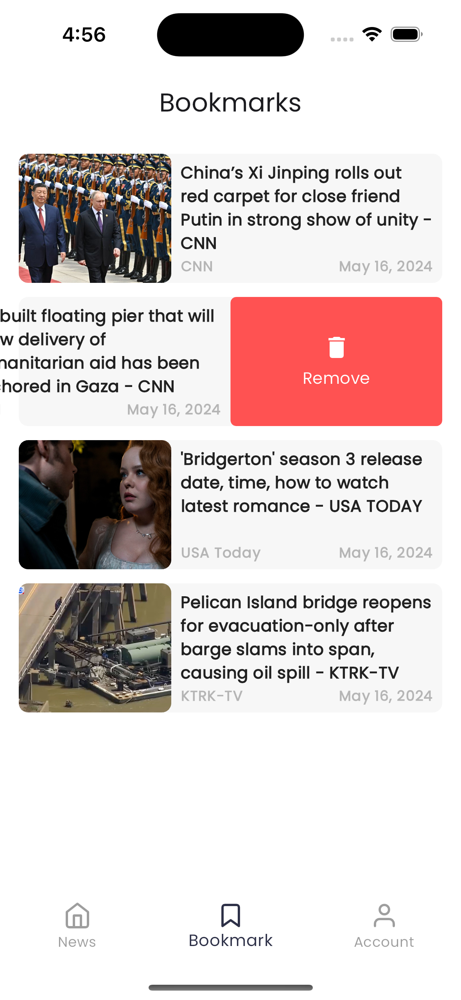
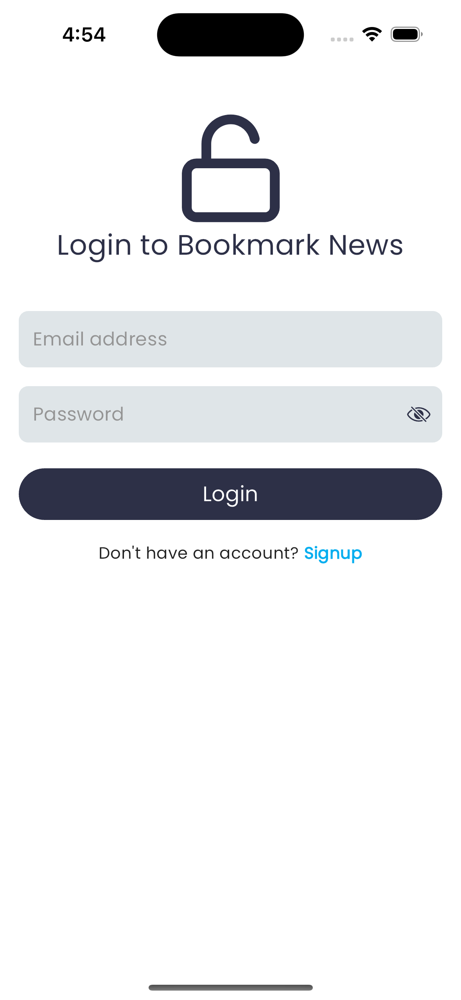
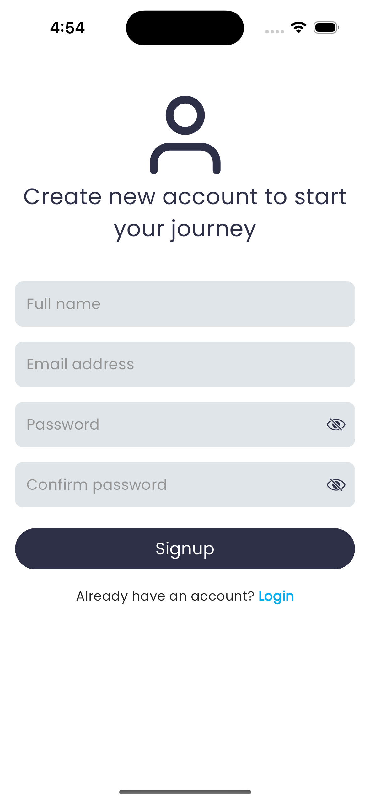
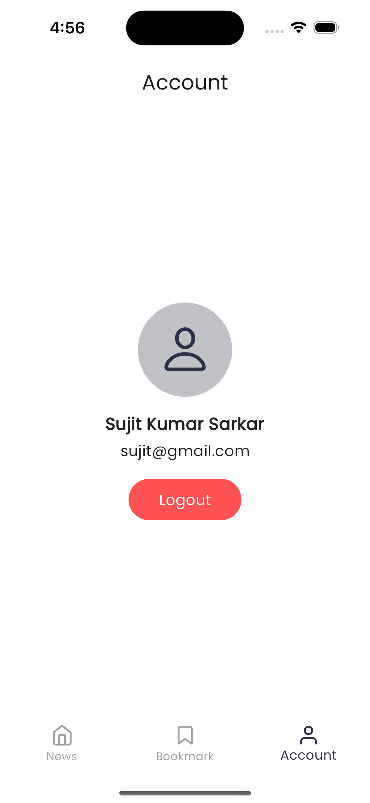
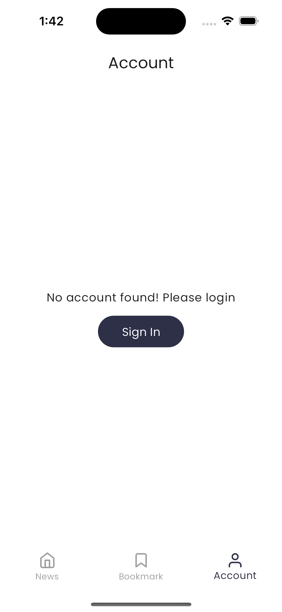

# News App
This is a newspaper application using the News API from (https://newsapi.org).
This app has many useful features like online and offline reading, bookmark news, user accounts. Users can bookmark any news by creating an account with email and password. This app also has a caching mechanism. When a user reads news in online, the app cache the news so that user can read news even device goes offline.

## Screenshots of News App
| News list screen                               | News Details screen                               |
|------------------------------------------------|---------------------------------------------------|
|           |      |

| Read more screen                               | Bookmark screen                                   |
|------------------------------------------------|---------------------------------------------------|
|      |          |

| Signin screen                                  | Signup screen                                     |
|------------------------------------------------|---------------------------------------------------|
|         |            |

| Account screen                                 | Signin Required                                   |
|------------------------------------------------|---------------------------------------------------|
|        |   |

## Apk link of News App
You can download the apk file from this (https://drive.google.com/drive/folders/1yd0CohkhcD533DFwkdAOqFRckjQxRtvi?usp=sharing) link.

## Architecture and libraries
Clean architecture has been used to develop this project. 
Used libralies and their purposes is given below:

google_fonts:           used for text fonts. 
firebase_auth:          used to integrate firebase authentication. 
cloud_firestore:        used to integrate firstore database. 
firebase_core:          used to initialize firstore database. 
fluttertoast:           for showing toash in the app. 
dio:                    using to fetch and parse REST API response. 
get:                    using for state management. 
feather_icons:          used to integrate icons library into this app. 
cached_network_image:   for caching network images. 
intl:                   used to convert the date format as human readable. 
lottie:                 used to display lottie animations. 
uuid:                   for generate random unique id. 
flutter_slidable:       used to enhance user experience dy slide listview item to perform a particular action. 
get_storage:            used to cache the api response. 
connectivity_plus:      used to get device internet connectivity status. 
flutter_inappwebview:   used to integrate webview. 